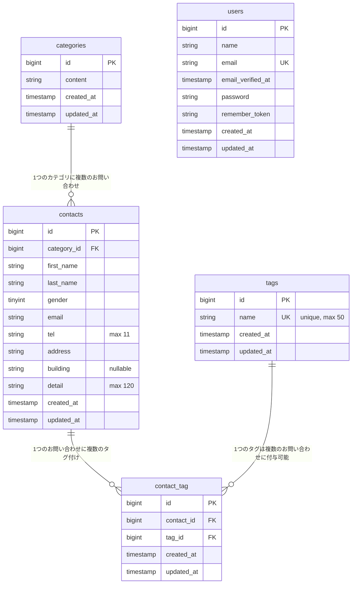

# ER図

お問い合わせフォーム確認テストのテーブル構成です。`categories` / `tags` / `contacts` / `contact_tag` はカスタム実装分（Phase0-5で作成）、`users` は管理者認証用にLaravel/Fortifyが提供する標準テーブルです。

## リレーション補足

- `contacts.category_id` → `categories.id`（`ON DELETE CASCADE`）
- `contact_tag.contact_id` → `contacts.id`（`ON DELETE CASCADE`）
- `contact_tag.tag_id` → `tags.id`（`ON DELETE CASCADE`）
- `contact_tag` は `contacts` と `tags` の多対多を仲介する中間テーブルで、`(contact_id, tag_id)` に複合ユニーク制約あり（同じお問い合わせに同じタグを重複付与できない）
- `users` は管理画面（`/admin`, `/login` など）の認証にのみ使用し、`contacts` 等とは直接のリレーションを持たない
